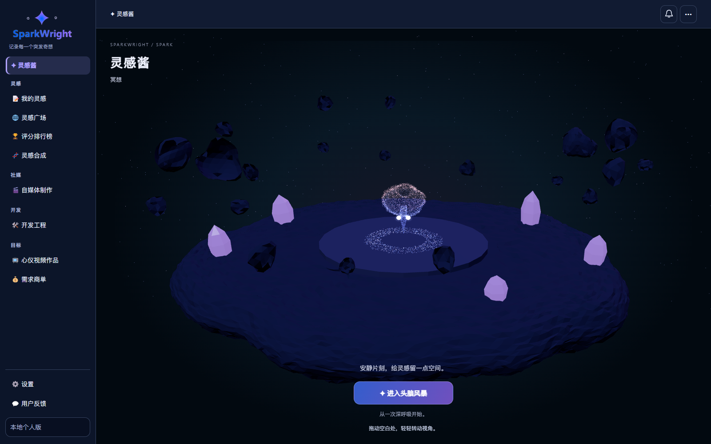

# SparkWright

**新手必看：[操作指南（HTML 图文版）](操作指南.html)**。下载并解压后，双击根目录的 `操作指南.html` 即可查看，无需先启动应用。

记录灵感，让灵感成为作品。SparkWright 集成灵感管理、AI 评分与合成、创作计划、开发项目、内容制作、需求商单与灵感酱 3D 互动。

前端：React + TypeScript + Vite。服务端：Fastify。数据库：SQLite。个人版无需注册或登录。支持中文 / English、四种主题和手机界面。



## 个人开源版

本仓库提供本地个人使用版本：启动后直接进入首页，不需要邮箱、密码、账号初始化或登录 Cookie。首次启动自动建立一个本地工作区身份，仅用于数据归属；不注册到任何远程网站。登录、注册和退出接口不启用，管理后台入口隐藏；普通设置、AI 配置、主题、语言与数据导出仍可使用。

升级已有的单账号个人数据库时，沿用原用户 ID、灵感与配置，不修改旧的邮箱或密码哈希。若数据库包含多个账号，启动会明确拒绝自动选择，请保留备份并使用多人版打开。

作者的多人运营实例使用独立配置与数据，本仓库不会连接或同步该实例。

## 快速开始

**Windows 一键启动：**安装 Node.js 22.12+ 后，双击根目录的 `启动SparkWright.bat`。首次运行自动安装依赖，服务就绪后自动打开浏览器；以后直接双击即可。请保持启动窗口打开，按 Ctrl+C 停止服务。如果个人版已经运行，会直接打开网址。

安装 Node.js 22.12+，在项目根目录运行：

```sh
npm ci
npm start
```

Windows PowerShell 请使用 `npm.cmd`，避免执行策略拦截 `npm.ps1`；无需修改系统执行策略：

```powershell
npm.cmd ci
npm.cmd start
```

等待安装完成后再启动，保持启动窗口打开。也可以在项目文件夹的资源管理器地址栏输入 `cmd`，再运行上面的通用命令。

启动后访问 `http://127.0.0.1:5318`，直接使用应用。以后只需运行 `npm start`，无需初始化账号。旧命令 `npm run account:init` 只会提示个人版无需登录。

个人版仅供本机使用：服务监听 `127.0.0.1`，拒绝非本机 Host、远程客户端和外部网站请求；写入接口保留来源校验。请勿通过公网反向代理、端口转发或局域网共享公开免登录个人版。多人运营使用独立的多人部署包。

开发：`npm run dev`，界面地址 `http://127.0.0.1:5310`。检查：`npm run typecheck`、`npm test`、`npm run build`。

完整操作步骤见 [SparkWright 使用说明书](docs/SparkWright使用说明书.md)。AI 评测工具说明见 [评测模板](eval-templates/scoring-v5/README.md)。评分规则说明见 [V5 评分说明](README_SCORING_V5.md)。

## 功能

- 我的灵感、标签、截止日期、状态、执行步骤与数据导出。
- V5 标准评分、一位小数、评分历史与自主报名排行榜；排除超过 60 秒及 100.0 分的评分。
- 两条不同灵感的随机合成，结果可高可低，导入后继续创作。
- 广场、频道讨论、近似在线人数与 owner 治理功能。
- 自媒体制作、开发工程、参考视频、需求商单与平台资源页。
- 用户反馈、通知、公告、管理后台与活跃趋势。
- 粒子灵感酱、3D 场景、四种主题、双语和移动端布局。
- 自愿支持作者：[爱发电](https://afdian.com/a/luoxijixian567)，应用内保留微信赞赏码。

## 配置与数据

`npm run setup:local` 自动生成本机 `.env` 中的认证密钥。可参照 [.env.example](.env.example) 设置端口及可选服务端 AI / 邮件配置。用户也可在「设置」填写自己的 OpenAI 兼容 Base URL、API Key 和模型名。

源码不包含真实 `.env`、数据库、账号、密码哈希、邮件凭据、API Key 或备份。运行时生成的 `.env`、`data/` 与 `node_modules/` 不应提交到 GitHub。个人 Key 当前存储于 SQLite，数据库及备份应按敏感凭据保管。

开源实例与作者运营的多人网站不共享数据、账号或 Key。本机反馈不会自动送达作者；代码问题可在项目 Issues 提交。

## 许可证与合作

本项目源码按根目录 [LICENSE](LICENSE) 中的 **Mozilla Public License 2.0（MPL-2.0）** 提供。非商业用途与商业用途均可按许可证使用；分发修改后的受覆盖文件时，请遵守 MPL 的源码提供和许可告知要求。

商业使用无须另行取得作者授权。付费支持、部署协助、定制开发与合作事项可另行联系 [作者](https://github.com/letsgo-6)，这些服务不改变 MPL 已授予的使用权利。第三方依赖适用各自的许可证，详见 [第三方声明](THIRD_PARTY_NOTICES.md)。

SparkWright 名称、Logo 和作者身份不应被用于暗示第三方服务获得作者背书。自行运营的服务请明确运营者及其数据处理政策。
